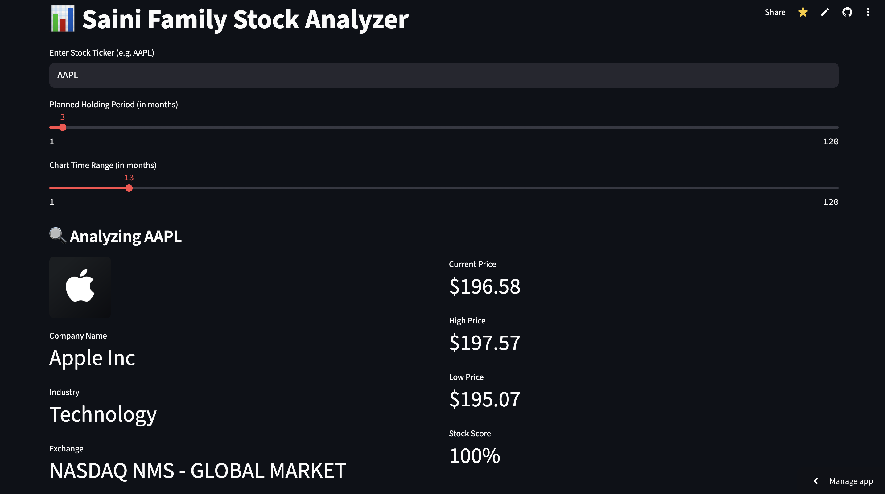

# 📈 Saini Family Stock Analyzer

Hi! This is the **Saini Family Stock Analyzer**. It's a smart and easy-to-use website that helps you check if a stock is good or not. It shows you important stuff about a stock, like how much it costs, if it's going up or down, and other companies like it.

---

## 🧠 What This App Does

* You type in a stock ticker (like `AAPL` for Apple).
* It shows a chart of the stock price over time.
* It tells you the company name, price, high and low prices, and more.
* It gives the stock a score out of 100 so you know if it’s doing okay.
* You can compare it to its peers (other similar companies).
* It even teaches you the basics of the stock market!

---

## 🚀 How to Run It

If you want to run this on your own computer:

1. Install the requirements:

   ```bash
   pip install -r requirements.txt
   ```
2. Make sure you have a `secrets.toml` file in the `.streamlit` folder:

   ```toml
   [secrets]
   FINNHUB_API_KEY = "your-finnhub-api-key"
   ```
3. Start the app:

   ```bash
   streamlit run stock_analyzer.py
   ```

Or just deploy it with **Streamlit Cloud** if you want to show your friends online.

---

## 🛠️ Features

* 📊 Price chart for up to 10 years (you pick how many months).
* 🧮 Stock score to see how healthy a stock looks.
* 🕵️ Peer comparison (other companies in the same group).
* 📚 Explains basic stock terms so you don’t get confused.

---

## 🔐 API Key Setup

This app uses **Finnhub** to get the stock data.

* Go to [finnhub.io](https://finnhub.io) and make a free account.
* Copy your API key.
* In Streamlit Cloud, click on **Secrets** and add:

  ```
  ```

FINNHUB\_API\_KEY = your\_key\_here

```

---

## 🖼️ What It Looks Like
()

---

## 👨‍💻 Made By
The Saini Family (Mostly one smart person, but the whole family gets credit!)

Enjoy the app and use it to get smarter about stocks!

```
